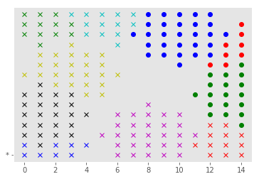
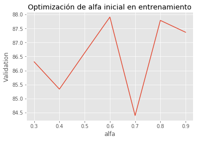
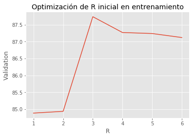
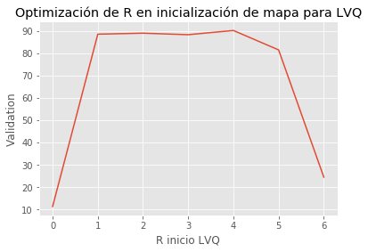
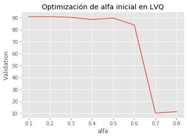

# Red tipo mapa de Kohonen

Implementación de red tipo mapa de Kohonen para reconocer caracteres manuscritos (clasificación con LVQ) y asociar caracteres parciales con caracteres completos (memoria asociativa).

## Descripción general de la red neuronal

- Ritmo de aprendizaje $\alpha(t)$:
Se seleccionó como ritmo de aprendizaje una función decreciente linealmente.

- Función de vecindad $h(|\bar{i}-\bar{g}|, t)$: Se eligió una función simple como es la escalón, donde el radio de vecindad R(t) desciende linealmente. 

- Métrica de similitud: distancia euclídea

## Acondicionamiento de los datos de entrada
El dataset utilizado es provisto por Keras. Para acondicionar la entrada del algoritmo, se normalizó los datos entre -1 y 1, dividiendo por 255, y luego se centró en la media haciendo uso de funciones proveídas por Numpy.

## División del dataset en conjuntos de train y test

La primer división del dataset fue en conjunto de entrenamiento y de testeo. El dataset consta de 60000 imágenes y se destinó aproximadamente el 30% a testeo, quedando 39600 imágenes para el entrenamiento de la red y 20400 para la posterior evaluación final.

Dentro del conjunto de entrenamiento, a su vez se implementó una evaluación de aprendizaje con **k-fold cross validation** con k igual a 3. Esto quiere decir que el conjunto de entrenamiento se dividió a su vez en subconjunto de entrenamiento y validación, también dejando el 30% para validación.
Esta división se reliza de 3 formas con los distintos tercios del conjunto de entrenamiento y se repitió el experimento 3 veces. Todo esto antes de realizar una última evaluación de la performance de la red con el conjunto de test.

## Arquitectura de la red neuronal

La red neuronal es una red **no supervisada** SOFM (Self-Organizing Feature Maps), con un mapa de 15x15 neuronas (para un mapa de mayor dimensión el tiempo de ejecución del entranamiento se elevaba demasiado para los fines prácticos del ejercicio), y donde las entradas serán vectores de 784 componentes.

La inicialización de los pesos sinápticos se hizo con números aleatorios entre -1 y 1 utilizando una distribución normal centrada en 0 y sigma igual a 0,2.

Una vez entrenada la red con el algoritmo básico para SOFM, se realiza un ajuste fino con LVQ (Learning Vector Quantization) para convertir la red en una red de clasificación. La inicialización del mapa para LVQ, es decir el etiquetado de las neuronas del mapa, se realizó dando 10 entradas, una de cada clase, y dando la clase correspondiente a aquellas neuronas que se activan.

Se intentó realizar esta inicialización con un algoritmo K-means pero no se obtuvieron mejores resultados.

El mapa entrenado es similar al de la imágen:

## Optimización de hiperparámetros
Para poder elegir los valores de hiperparámetros indicados y subir el rendimiento de la red, se hizo una optimización muy gruesa dado el tiempo de ejecución del programa y la cantidad limitada de recursos computacionales.

## Resultados obtenidos

Los tres experimentos realizados para completar el k-fold, finalizarón con el siguiente porcentaje de éxito en validación:

1) 87.47771836007131 
2) 84.97857361493725 
3) 89.13376186103459

Todos porcentajes aceptables para los fines del estudio.

Finalmente una vez entrenado para comparar con el conjunto de test, se obtuvo el 91.07% de imágenes clasificados correctamente.