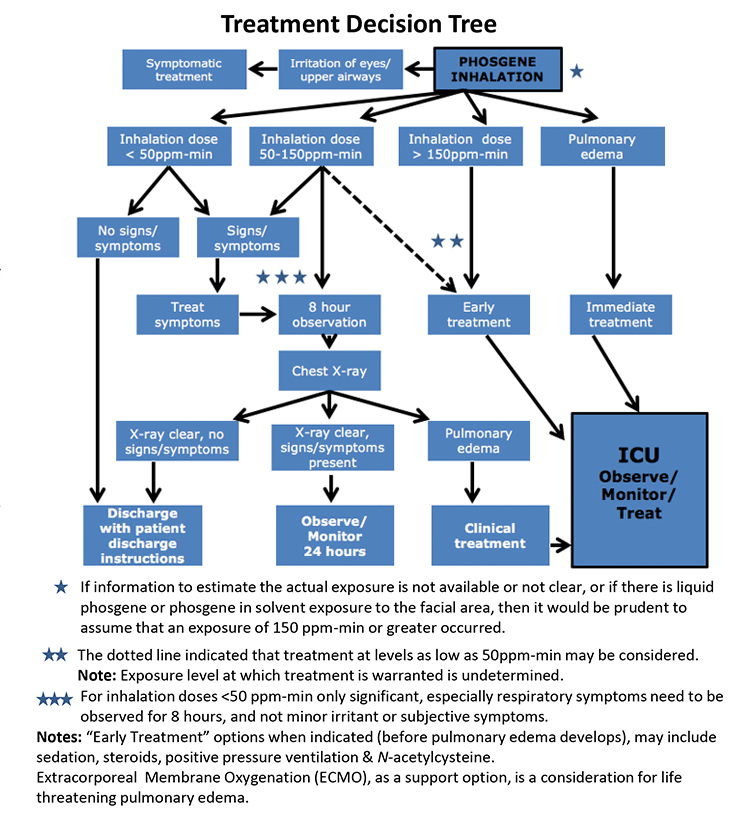

---
title:  'Trabajo práctico N°2: Razonamiento'
date: "Mayo de 2019"
author:
- Gino Avanzini
- Emiliano Cabrino
- Adrián Cantaloube
- Gonzalo Fernández

...

# Desarrollo y análisis de una base de conocimiento para una planta de reducción de presión de gas

Utilizamos el lenguaje Prolog para generar la base de conocimientos según los lineamientos de la gráfica de acción de la planta.

De forma sencilla, en el archivo “ejercicio1bis.pl” ingresamos las reglas axiomáticas y los ground facts. Las primeras las escribimos de tal manera que Prolog acceda a su algoritmo interno de backtracking permitiendo verificar, primero si el estado en el que nos encontramos analizando es válido, para luego buscar el axioma superior a él (de cumplirse la condición) y verificar el nuevo estado para saber si detenerse y entregar la orden o continuar buscando de forma automática. Los estados se podrán modificar dinamicamente utilizando los comandos assert y retract, modificándolos según lo que ocurra en la planta. Una vez cerrado el programa estos cambios en las condiciones de los estados se perderán.

Se presentó una variante de este problema (el archivo “ejercicio1.pl”) sin el uso del backtracking en donde el usuario puede acceder a cualquier parte del árbol formulando la pregunta e indicando si esta es verdadera o falsa según lo que suceda en la planta. El programa le dirá que acción tomar. Esto puede ser o una orden o que se verifique otro axioma. Aquí no serán necesarios los comandos assert y retract ya que los estados se han indicado como variables que el usuario debe ingresar al hacer la pregunta, o sea, que no forman parte de los ground facts. En este enfoque también se agregaron valores de variables como thickness o max regulating pressure para distintos tipos de válvulas (sv y rv) como se sugiere en el enunciado del ejercicio.

Además se realizó otro ejercicio con el uso del árbol de decisión para tratamiento médico ante la inhalación de fosgeno[^1]. La base de conocimiento se encuentra en el archivo *treatment.pl*

[^1]: [PHOSGENE: Information on Options for First Aid and Medical Treatment](https://www.americanchemistry.com/Phosgene/Medical-Treatment-Decision-Tree-for-Medical-Professionals.html), American Chemistry Council. 
