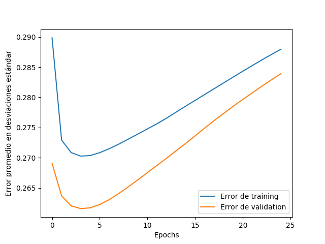
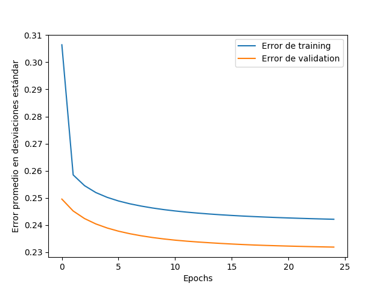
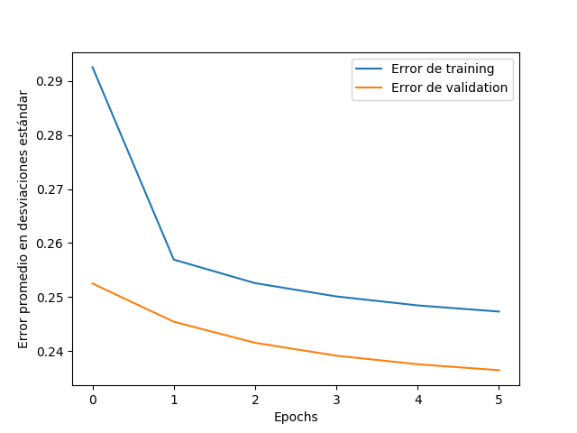

---
title:  'Trabajo práctico N°3: Machine Learning'
author:
- Gino Avanzini
- Emiliano Cabrino
- Adrián Cantaloube
- Gonzalo Fernández

...

# Implementación de una red neuronal tipo multi-layer perceptron (MLP)

El objetivo de este ejercicio es la Implementación de un MLP y entrenar la red con distintos casos. En primera instancia se intentará predecir el valor de casas con el famoso dataset de "USA Housing" (ver /TP_3/datasets). Luego se entrenará la red con un dataset generado a partir del controlador difuso para el péndulo invertido realizado en el trabajo práctico 2. De esta forma se intentará controlar el péndulo con la red neuronal. 

## Topología de la red

El MLP implementado es una red neuronal con 3 capas: una de entrada, una de salida y una capa oculta. La cantidad de neuronas en la capa oculta se deja como parámetro mientras que la cantidad de neuronas de entrada y de salida son variables de acuerdo al problema. 

En cuanto a las funciones de activación, para la capa oculta se utilizó una función sigmoide mientras que para la capa de salida, la identidad. Estas funciones pueden ser cambiadas en cualquier momento sin la necesidad de reescribir cualquier parte del código salvo la que modifica la función. Esto no se realizó en la práctica debido a restricciones de tiempo y para reducir la cantidad de hiperparámetros a tunear. 

## Preprocesamiento de datos

Lo primero que se realizó fue el preprocesamiento de los datasets de USA Housing y del péndulo invertido. Para realizar de forma correcta el entrenamiento y la puesta en producción del MLP se dividieron los datasets en conjuntos de training, validation y test. 

Para esto, en primera instancia se filtraron los datos y se mantuvieron aquellos campos que contenían información que a priori puede ser valiosa y se eliminaron los campos que no nos darían información, como la dirección precisa de la casa en el dataset de USA Housing. 

Luego se procedió a la normalización de los datos de los campos. Dado que las escalas de las columnas eran muy distintas en órdenes de magnitud, era necesario normalizar los datos para que todos los valores estén en los mismos rangos. Para esto para cada valor, por columna, se sustrajo el valor de la media de la columna y posteriormente se dividió por la desviación estándar del campo. De esta forma, cada uno de los valores está expresado en cantidad de desviaciones estándar respecto a la media del campo. Los valores de media y desviación estándar fueron obtenidos del conjunto de training y aplicados a todo el dataset. De esta forma los valores que contienen los conjuntos de validation y test están totalmente separados del training de la red.

## Implementación del algoritmo

Para implementar el MLP se realizó un script en Python y se utilizó mayormente la librería numpy para las operaciones matriciales involucradas en el cálculo de la salida de la red y en el entrenamiento mediante el algoritmo de backpropagation. La descripción de los algoritmos nombrados se puede encontrar en las presentaciones y apuntes de cátedra. 

### Inicialización de pesos y biases

Los valores iniciales de los pesos fueron generados aleatoriamente en un rango de (-1, 1) con una distribución uniforme, mientras que los biases fueron inicializados en 0,01. 

### Salida de la red, entrenamiento y backpropagation

En el cálculo de la salida de la red y en el algoritmo de backpropagation se utilizaron operaciones matriciales para evitar la realización de tantos bucles for. Como se puede inferir por el título de la sección, para realizar el entrenamiento de la red se utilizó backpropagation y en ambos problemas se dejó el ritmo de aprendizaje en 0.01. Se probó con otros valores pero este fue el dio resultados no oscilatorios y era aceptablemente rápido en entrenar.

### Cálculo de error (accuracy)

Para describir el comportamiento de la red se calculó qué tan bien predecía los valores de las casas y la fuerza en el péndulo en base al promedio de los errores relativos entre la salida de la red y el valor esperado para el conjunto de validación. Estos errores están medidos en desviaciones estándar alrededor de la media calculada en el conjunto de training. Así, un error de 0.24 significa que el promedio de errores, es de 0.24 desviaciones estándar alejado de la media. 

La cantidad de epochs de entrenamiento fue variable pero finalmente nos decantamos con aquella cantidad que nos provee un error menor al 1% entre una epoch y la anterior para el conjunto de validación. Siempre obtuvimos errores en el conjunto de test del orden de los obtenidos en el conjunto de validación, por lo que no fue necesario prevenir el overfitting sobre la validación.

## Uso en la prediccion de valor de las casas

Con el algoritmo ya hecho se prosiguió a entrenar la red con el dataset de USA Housing, compuesto por 5000 ejemplos. Este se dividió en training (0-3500), validation (3501-4200) y test (4201-5000). Seteamos la cantidad de neuronas de la capa oculta a 25 y la cantidad de epochs a 25 y variamos el ritmo de aprendizaje. Se observó que para un ritmo de aprendizaje mayor empezaba a aumentar el error. Se hicieron pruebas con distintas cantidades de neuronas en la capa oculta y no encontramos un gran impacto en la performance. 

Al ver que no era necesario entrenar por tantas epochs dejamos de entrenar epochs cuando el error relativo entre una epoch y la anterior, respecto al conjunto de validación fue menor al 1%. De esta manera se obtuvo que con 6 epochs fue suficiente. 

Sobre el conjunto de test obtuvimos una accuracy de 0.2469, lo que significa que estuvimos, en promedio, alejados 0.2469 desviaciones estándar de la media de los valores esperados. En dólares tuvimos un error absoluto promedio de U$S 88000, 5% del precio de la media. 

Para dar un ejemplo, para el último ejemplo del dataset, los precios son, en desviaciones estándar:

- precio_real = 0.1894114308541653
- precio_predicho = 0.23078116332519005

Lo que en dólares se traduce a:

- precio_real = 1298945
- precio_predicho = 1313556

E implica una diferencia de 14611 dólares, lo que es un 1.1% de diferencia. 

## Uso en el controlador difuso

### Generación del dataset

### Entrenamiento

### Resultados 
